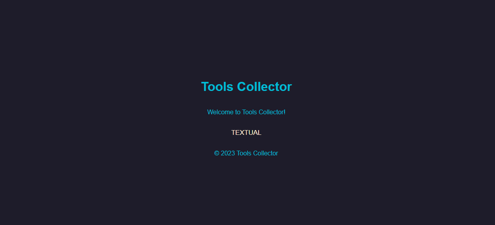
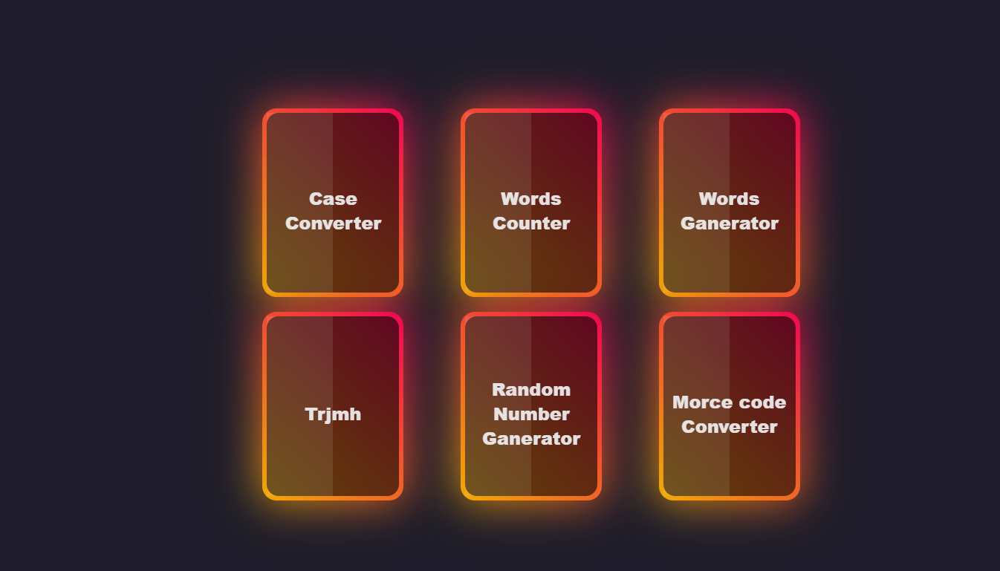

# Tools Collector

## Project Overview

Tools Collector is a web-based application that was intended to serve as a collection of various tools. However, due to limited skills at the time of development, only textual tools were added. The project includes simple yet useful tools such as case converters, Morse code converters, random number generators, and more.





## Features

- **Case Converter**: Convert text to lowercase, uppercase, or sentence case.
- **Morse Code Converter**: Convert text to Morse code and vice versa.
- **Random Number Generator**: Generate random numbers with specified precision.
- **Character Translator**: Translate between English and Arabic characters.
- **Word Counter**: Count the number of words, letters, lines, and numbers in a given text.
- **Word Generator**: Generate random words.

## File Structure

```planetext
ToolsCollector/
├── index.html
├── Style.css
├── Textual.html
└── Textual_tools/
    ├── CaseConverter.html
    ├── MorcecodeConverter.html
    ├── RandomNumberGanerator.html
    ├── Trjmh.html
    ├── WordCounter.html
    ├── words.txt
    └── WordsGanerator.html
```

### index.html

The main entry point of the application. It includes links to the Textual tools page and a brief introduction.

### Style.css

Contains the styling for the main page and the Textual tools page.

### Textual.html

A sub-page that lists all the textual tools available in the application. Each tool is displayed as a card that the user can click to access the specific tool.

### Textual_tools/

A directory that contains all the HTML files for the individual tools:

- **CaseConverter.html**: Converts text to different cases.
- **MorcecodeConverter.html**: Converts text to Morse code and Morse code to text.
- **RandomNumberGanerator.html**: Generates random numbers based on user-defined precision.
- **Trjmh.html**: Translates characters between English and Arabic.
- **WordCounter.html**: Counts words, letters, lines, and numbers in a text.
- **WordsGanerator.html**: Generates random words.

## Tools Descriptions

### Case Converter

Converts input text to lowercase, uppercase, or sentence case.

- **Input**: Text to be converted.
- **Options**: Lowercase, Uppercase, Sentence Case.
- **Output**: Converted text.
- **Copy to Clipboard**: Button to copy the converted text to the clipboard.

### Morse Code Converter

Converts text to Morse code and Morse code to text.

- **Input**: Text or Morse code.
- **Options**: Convert to Morse, Convert to Text.
- **Output**: Converted text or Morse code.
- **Copy to Clipboard**: Button to copy the converted text to the clipboard.

### Random Number Generator

Generates random numbers within a specified range and precision.

- **Input**: Minimum and maximum values, precision (integer, 1 decimal, 2 decimals).
- **Output**: Generated random number.
- **Copy to Clipboard**: Button to copy the generated number to the clipboard.

### Character Translator

Translates characters between English and Arabic.

- **Input**: Text to be translated.
- **Options**: English to Arabic, Arabic to English.
- **Output**: Translated text.

### Word Counter

Counts the number of words, letters, lines, and numbers in the input text.

- **Input**: Text to be analyzed.
- **Output**: Count of words, letters, lines, and numbers.

### Word Generator

Generates random words.

- **Input**: Number of words to generate.
- **Output**: Generated words.
- **Copy to Clipboard**: Button to copy the generated words to the clipboard.

## Adding More Tools

To add more tools to the Tools Collector, follow these steps:

1. **Create a New HTML File**:

   - Create a new HTML file for your tool in the `Textual_tools` directory. For example, `NewTool.html`.

2. **Design the Tool**:

   - Design your tool's interface in the newly created HTML file. Ensure that it follows the existing style and structure for consistency.

3. **Add a Card for the New Tool**:

   - Open `Textual.html`.
   - Add a new card in the `.card-container` div. Copy an existing card and modify it for your new tool. For example:
     ```html
     <div class="card" onclick="openTool('NewTool')">
       <span></span>
       <div class="content">New Tool</div>
     </div>
     ```
   - Update the `openTool` function to include your new tool's HTML file name.

4. **Link the New Tool**:

   - Ensure that the `openTool` function in the `Textual.html` is updated to open your new tool's HTML file correctly:
     ```javascript
     function openTool(toolName) {
       const htmlFilePath = `Textual_tools/${toolName}.html`;
       window.open(htmlFilePath, "_self");
     }
     ```

5. **Style the New Tool**:
   - If needed, add specific styles for your new tool in the `Style.css` file or directly within the new HTML file's `<style>` tag.

## Adding New Types of Tools (e.g., Visual Tools)

To add a new type of tools (e.g., visual tools), follow these steps:

1. **Create a New Directory**:

   - Create a new directory for the new type of tools. For example, `Visual_tools`.

2. **Create a New HTML File**:

   - Create a new HTML file for your tool in the newly created directory. For example, `NewVisualTool.html`.

3. **Design the Tool**:

   - Design your tool's interface in the newly created HTML file. Ensure that it follows the existing style and structure for consistency.

4. **Create a New Main Page for the Tool Type**:

   - Create a new main HTML file for the new type of tools. For example, `Visual.html`.
   - This file should list all the visual tools available in the application. Each tool should be displayed as a card that the user can click to access the specific tool.

5. **Add a Card for the New Tool**:

   - Open `Visual.html`.
   - Add a new card in the `.card-container` div. Copy an existing card and modify it for your new tool. For example:
     ```html
     <div class="card" onclick="openTool('NewVisualTool')">
       <span></span>
       <div class="content">New Visual Tool</div>
     </div>
     ```
   - Update the `openTool` function to include your new tool's HTML file name.

6. **Link the New Tool**:

   - Ensure that the `openTool` function in the `Visual.html` is updated to open your new tool's HTML file correctly:
     ```javascript
     function openTool(toolName) {
       const htmlFilePath = `Visual_tools/${toolName}.html`;
       window.open(htmlFilePath, "_self");
     }
     ```

7. **Update index.html**:

   - Update the main `index.html` file to include a link to the new main page for visual tools.
     ```html
     <div class="button-container">
       <button class="btn" onclick="openTool('Textual')">Textual</button>
       <button class="btn" onclick="openTool('Visual')">Visual</button>
     </div>
     ```

8. **Style the New Tool**:
   - If needed, add specific styles for your new tool in the `Style.css` file or directly within the new HTML file's `<style>` tag.

## Usage

To use the application, open the `index.html` file in a web browser. From the main page, you can navigate to the Textual tools page, where you can access various utilities.

## Note

This project was created as a learning exercise during the early stages of web development and may contain basic and simple code. The project was supposed to include various tools, but due to lack of skills at the time, only textual tools were added.

## Conclusion

Tools Collector was a foundational project in the journey of learning web development. Although it currently only includes textual tools, it showcases the basic principles of building web applications and integrating various functionalities. The project serves as a testament to the growth and learning process in web development. Future enhancements could include adding more types of tools, improving the design, and optimizing the codebase for better performance and user experience.
